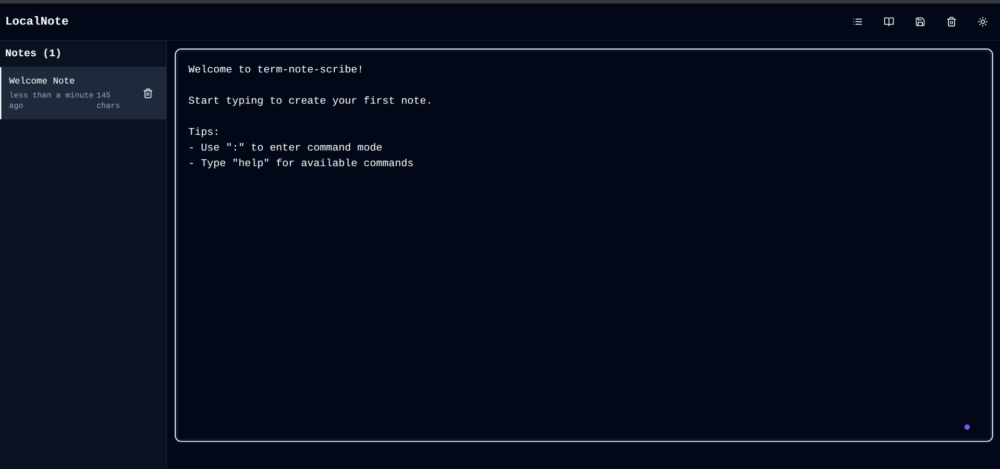
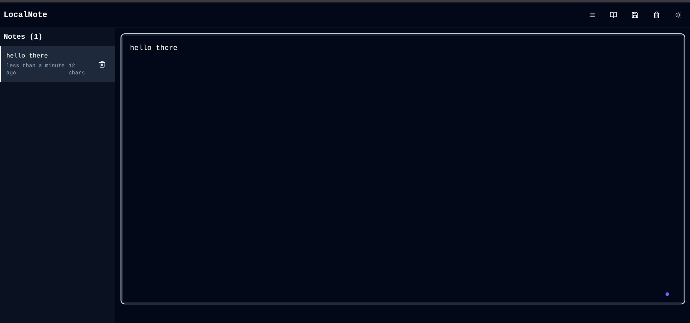
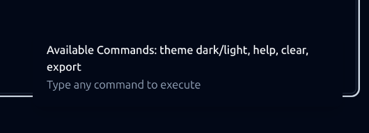
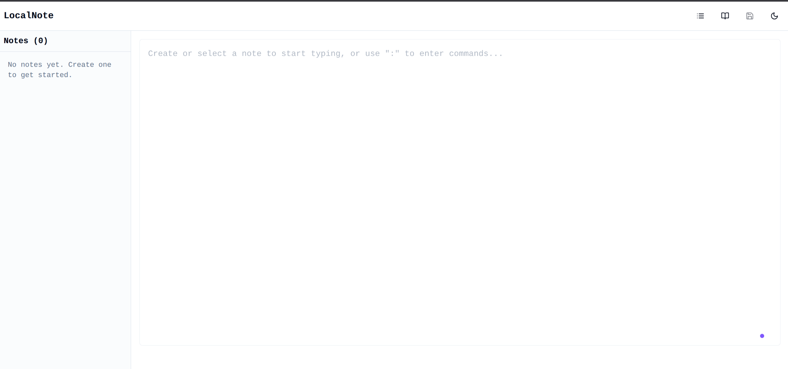

# 📝 LOCALNOTE

**LOCALNOTE** is a minimal, terminal-inspired notebook app built for speed, simplicity, and privacy. Write notes in a clean interface with support for light/dark themes, Markdown formatting, and zero backend — everything is stored locally in your browser.

## ⚡ Tech Stack

- [Vite](https://vitejs.dev/) – Fast build tool and dev server
- [TypeScript](https://www.typescriptlang.org/) – Typed JavaScript
- [Tailwind CSS](https://tailwindcss.com/) – Utility-first styling
- [LocalStorage API](https://developer.mozilla.org/en-US/docs/Web/API/Window/localStorage) – Data persistence
- Markdown (raw or via parser)

---

## 🧰 Features

- 🖥 Terminal-style UI
- 🌗 Light / Dark mode toggle
- 💾 Saves notes in your browser (LocalStorage)
- 📝 Supports Markdown syntax
- 📤 Export notes to `.md` files
- 🛠️ Built with modern tools (Vite, Tailwind, TypeScript)
- 🔒 100% offline – no accounts or internet required

---

## 🛠️ Project Setup

```bash
# Clone the repo
git clone https://github.com/yourusername/localnote.git
cd localnote

# Install dependencies
npm install

# Run locally
npm run dev

# Build for production
npm run build
````

---

## 🗃️ File Structure

```
LOCALNOTE/
├── public/                # Static assets
├── src/
│   ├── assets/            # Images, fonts, etc.
│   ├── components/        # UI components (NoteEditor, Header, ThemeToggle)
│   ├── styles/            # Global styles
│   ├── utils/             # Storage and helper logic
│   ├── App.tsx            # Root component
│   └── main.tsx           # Vite entry point
├── index.html             # HTML shell
├── tailwind.config.ts     # Tailwind configuration
├── vite.config.ts         # Vite configuration
├── package.json           # NPM config and scripts
└── README.md              # You're here
```

---

## 📄 Export Notes

Click the export button (or use keyboard shortcut `Ctrl + E`) to download your current note as a `.md` file.

---

## 💡 Future Features (Planned)

* ⌨️ CLI-style commands (`:new`, `:save`, `:theme`, etc.)
* 🧠 Auto-save multiple notes with titles
* 🏷️ Tags and filters
* 🔐 Password-protected notes (local only)
* 🧪 Live Markdown preview (optional)

---

## 📸 Screenshots






> *Coming soon...*

---

## 📃 License

MIT License – free to use, modify, and share.

---

> Built by Othmane with 💻☕ and a love for minimal software.

